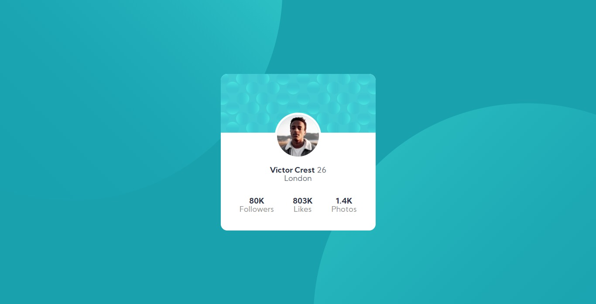

# Frontend Mentor - Profile card component solution

This is a solution to the [Profile card component challenge on Frontend Mentor](https://www.frontendmentor.io/challenges/profile-card-component-cfArpWshJ). Frontend Mentor challenges help you improve your coding skills by building realistic projects. 

## Table of contents

- [Overview](#overview)
  - [The challenge](#the-challenge)
  - [Screenshot](#screenshot)
  - [Links](#links)
- [My process](#my-process)
  - [Built with](#built-with)
  - [What I learned](#what-i-learned)
  - [Continued development](#continued-development)
  - [Useful resources](#useful-resources)
- [Author](#author)

## Overview

### The challenge

- Build out the project to the designs provided

### Screenshot

### Links

- Solution URL: [Add solution URL here](https://your-solution-url.com)
- Live Site URL: [Add live site URL here](https://your-live-site-url.com)

## My process

### Built with

- HTML5 markup
- CSS custom properties
- Flexbox

### What I learned

I had the opportunity to use some CSS properties that I hadn't used until this project (like background-image) and practice Flexbox.

### Continued development

I want to continue aprimoring my CSS knowledge to make better (and responsive) designs and practice semantic HTML markup.

### Useful resources

- [CSS Background Tutorial (W3schools)](https://www.w3schools.com/css/css_background.asp) - This tutorial helped me to set the background images in the website (even I haven't made it very well, at least it works).

## Author

- Frontend Mentor - [@luizhf42](https://www.frontendmentor.io/profile/luizhf42)
